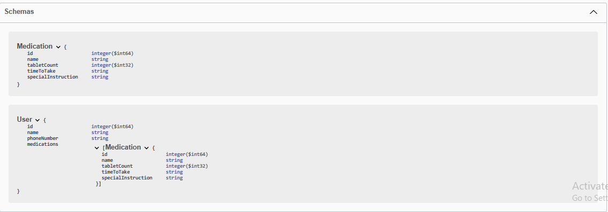
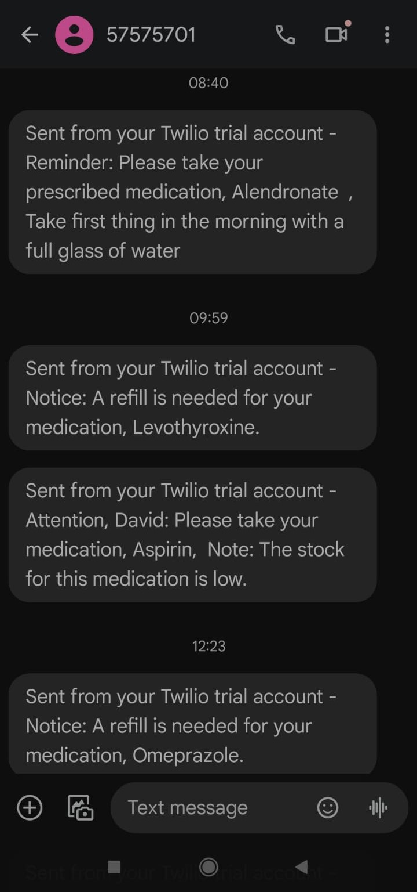
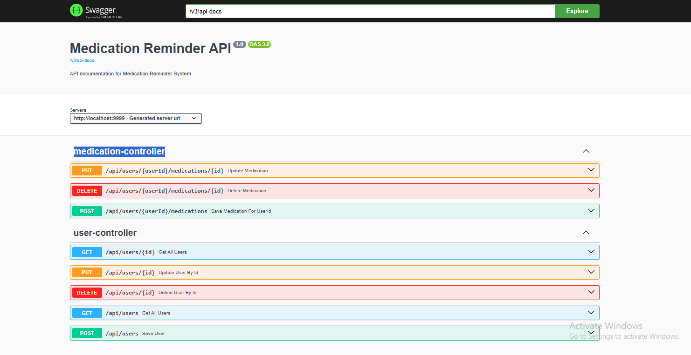

# 📲 MediAlert - Medication Reminder App

MediAlert is a medication reminder application built with 💻 **Spring Boot**. This app helps users manage their medication schedules by sending automated 📱 SMS reminders through the **Twilio API**. **Swagger** is used for API documentation, and **SLF4J** provides structured logging for easy monitoring.

---

## ✨ Features

- 👤 **User Management**: Easily manage user details with CRUD operations.
- 💊 **Medication Management**: Manage medications and schedules with CRUD operations.
- 📩 **SMS Reminders**: Sends automated SMS reminders to users at specified times.
- 📜 **API Documentation**: Interactive Swagger UI for testing and exploring the API.
- 📝 **Logging**: SLF4J-powered logging for monitoring and debugging.

---

## ⚙️ Technologies Used

- **Spring Boot** - Backend framework for handling API endpoints and business logic.
- **Swagger** - For interactive API documentation.
- **SLF4J** - Logging API for tracking application behavior.
- **Twilio API** - For sending SMS notifications as medication reminders.

---

# 🧑‍💻 API Endpoints Documentation

## 👤 User Endpoints
- **GET** `/api/users` - Retrieve all users.  
  📝 *Fetches a list of all users from the system.*

- **GET** `/api/users/{id}` - Retrieve user details by user ID.  
  📝 *Fetches details for a specific user by their ID.*

- **POST** `/api/users` - Add a new user.  
  📝 *Creates a new user in the system.*

- **PUT** `/api/users/{id}` - Update user details by user ID.  
  📝 *Updates details of a specific user using their ID.*

- **DELETE** `/api/users/{id}` - Delete a user by user ID.  
  📝 *Deletes a user from the system using their ID.*

## 💊 Medication Endpoints
- **GET** `/api/users/{userId}/medications` - Retrieve all medications for a specific user.  
  📝 *Fetches a list of medications associated with a specific user.*

- **POST** `/api/users/{userId}/medications` - Add a medication for a specific user.  
  📝 *Adds a new medication for a user.*

- **DELETE** `/api/users/{userId}/medications/{id}` - Delete a medication by ID for a specific user.  
  📝 *Deletes a medication by ID for a specific user.*
  
---

## 📋 Entity Structure

### 👤 User       💊 Medication



---

## 🛠️ Getting Started

### Prerequisites
- **Java 11 or later** ☕
- **Maven** 📦
- **Twilio Account** (for sending SMS reminders)

--- 

### Installation

1. **Clone the repository:**
   ```bash
   git clone https://github.com//MediAlert.git```
2.**Navigate into the project directory:**
```bash
  cd MediAlert
```
3. **Install dependencies:**
```bash
  mvn install
```
4. **Configure Twilio credentials in application.properties:**
   ```bash
twilio.accountSid=your_account_sid
twilio.authToken=your_auth_token
twilio.fromPhoneNumber=your_twilio_phone_number ```

5.**Run the application:**
```bash
mvn spring-boot:run ```

---

### 📖 Usage
Access the Swagger API Documentation:

Open a browser and navigate to:
```bash
 http://localhost:9999/swagger-ui/index.html
```
Explore the API: Use the Swagger interface to test the API endpoints for user and medication management.

---

## 📩 SMS Notification Example
This is an example of an SMS reminder that will be sent to the user:<br>


## 📄 Swagger API Documentation
The application includes an interactive Swagger UI for exploring and testing the API.


## 📝 Logging
MediAlert uses SLF4J for structured logging, helping track application activity, including API calls and error handling.

---

# Contribution Guide

We welcome all contributions to improve **MediAlert**! To contribute, follow the steps below:

## Steps to Contribute

1. **Fork the repository**  
   🍴 *Fork the repository to your GitHub account.*

2. **Create a new branch**  
   🌿 *Create a new branch for your feature.*  
   Example: `feature/YourFeature`

3. **Commit your changes**  
   ✍️ *Make changes to the code and commit them to your branch.*

4. **Push to the branch**  
   🚀 *Push your changes to the branch on your forked repository.*

5. **Open a Pull Request**  
   🔄 *Create a pull request from your branch to the main repository to propose your changes.*

We look forward to your contributions to make **MediAlert** better! Thank you for your effort.


